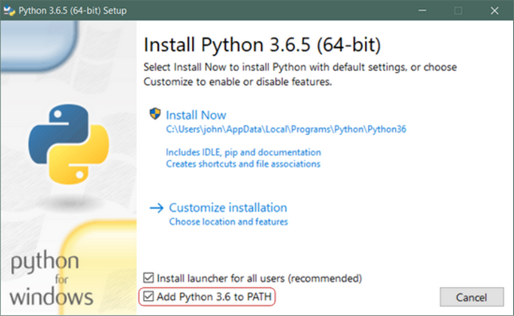
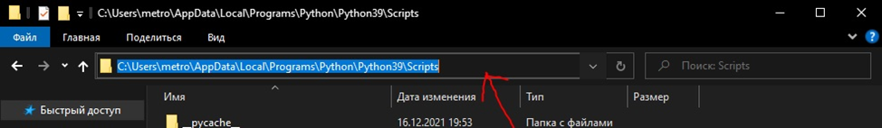
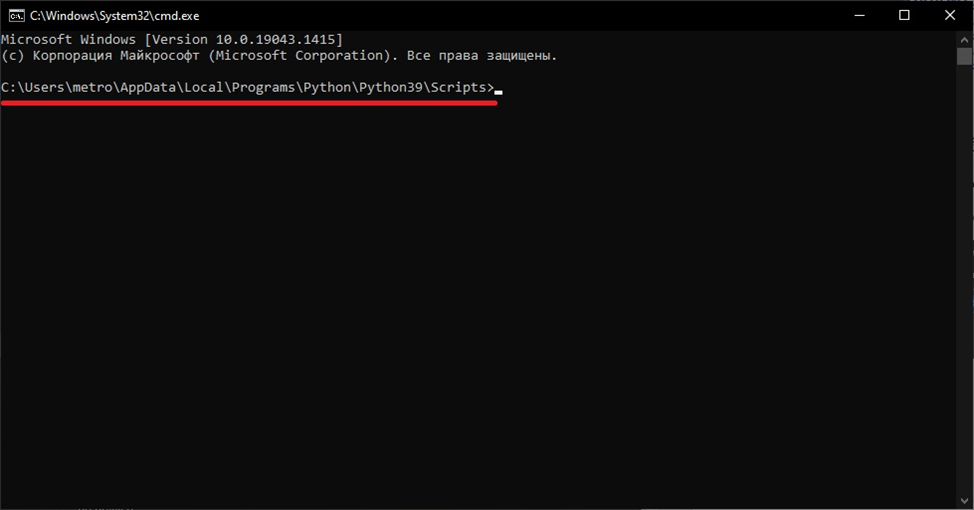
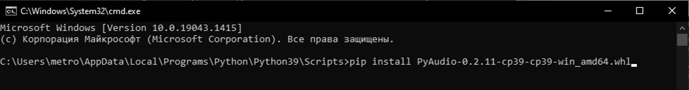

#Инструкция по установке программы
###1.	Определяем разрядность вашей системы Windows.
Для этого необходимо нажать “Пуск” и выбрать пункт “Параметры”. 
Открыть раздел “Система” и перейти на “О системе” (“О программе”). 
На открывшейся странице будет указан тип системы.

###2.	Устанавливаем Python на компьютер.
Заходим на официальный 
[сайт](https://www.python.org/downloads/windows/), 
в разделе “Downloads” выбираем “Windows” и скачиваем Python 3.9 
для вашего типа системы.

После того, как вы выбрали установочный файл и загрузили его, 
просто запустите его двойным нажатием на загруженный файл. Должен 
открыться диалог, который выглядит следующим образом:



***Важно!*** Убедитесь в том, что вы установили флажок в разделе 
***Add Python 3.x to PATH***, чтобы интерпретатор был установлен 
в вашем пути выполнения.
Далее, просто нажмите на ***Install Now***. Это все, что нужно. 
Через несколько минут у вас в системе должен быть рабочий Python 3

###3.	Устанавливаем необходимые библиотеки для работы программы.
Нам потребуются: 
```
• PyAudio
• Vosk
• Pyttsx3
• Threading
• Logging
• JSON
• NumPy 
• OpenCV 
• qimage2ndarray
• math
• time
• PyQt5
```


Для установки ***PyAudio*** необходимо перейти по 
[ссылке](https://www.lfd.uci.edu/%7Egohlke/pythonlibs/#pyaudio), 
выбрать установочный файл подходящей установленной версии Python и 
типа системы.


Скачанный файл помещаем в папку 
***C:\Users\User\AppData\Local\Programs\Python\Python39\Scripts***

В этой же папке выделяем путь проводника и пишем там “cmd” и жмем 
“Еnter”.



Откроется командная строка с уже выбранным расположением файловой 
системы



В командной строке печатаем команду pip install и полное имя 
скаченного файла, жмем “Еnter”.
Пример: 



Произойдет установка библиотеки PyAudio.

***Для установки остальных библиотек там же по очереди пишем pip 
install “имя библиотеки” и жмем “Еnter”.***

###4.	Запуск программы.
Для корректного запуска программы все ее модули должны находиться в 
одной папке, а именно: 

Фалы:

    o	main.py

    o	GUI.py
    
    o	func_command.py

    o	text_reproduction.py

    o	frozen_inference_graph.pb 

    o	graph.pbtxt

•	Папка с файлами:

     o	osk-model-small-ru-0.4

Запуск программы происходит выполнением файла ***“main.py”*** 
(дважды кликнуть по нему). 

logger ставится скачиваем библиотеку вручную и устанавливаем пипом


opencv.aruco
pip install opencv-contrib-python
